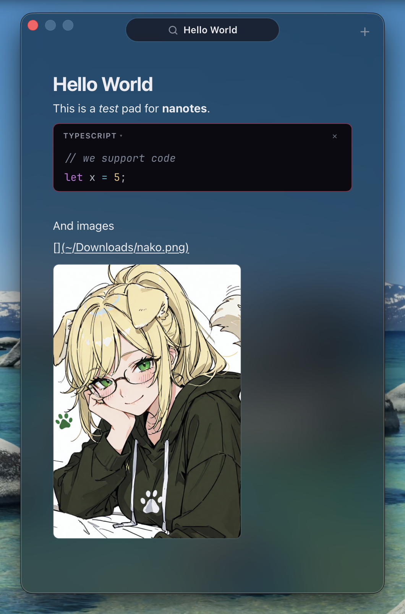

<p align="center">
  
</p>

<h1 align="center">NaNotes</h1>

NaNotes is a Nako-styled floating Markdown scratchpad backed by a local notes folder. It's built for people who want a quick, always-a-hotkey-away notepad whose notes stay as plain `.md` files — one file per note, no proprietary database.

Press <kbd>⌥</kbd>+<kbd>N</kbd> on macOS or <kbd>Alt</kbd>+<kbd>N</kbd> on Linux from any app and a dark, pink-on-black overlay appears on top of whatever you're doing. Type Markdown, autosave to a local file, and dismiss it with <kbd>Escape</kbd>. It runs quietly in the background and stays out of the Dock/app switcher or taskbar.

<p align="center">
  
</p>

## Features

- **Global hotkey overlay** — <kbd>⌥</kbd>+<kbd>N</kbd> toggles a floating, always-on-top window over any app. Rebind it to any combo from settings.
- **Plain Markdown files** — every note is a normal `.md` file in a folder you choose. Edit them with any other tool too.
- **Live Markdown editing** — a single-pane CodeMirror editor styles Markdown inline as you type: headings, bold/italic, links, and bullets render in place.
- **Syntax-highlighted code blocks** — fenced ``` blocks render as a card with a language chip; click it to pick from any of CodeMirror's bundled languages.
- **Inline image previews** — `` (or a plain link to an image file) renders the image below the line. Local paths, `~/`, and URLs all work, with path autocompletion as you type the target.
- **Task lists** — type `[]` (or `- [ ]`) to get a clickable checkbox; toggling it writes the state back to the file.
- **Fuzzy search** — <kbd>⌘</kbd>+<kbd>P</kbd> searches note titles and contents and shows the top matches; pin notes to keep them on top or delete them (to the Trash) right from the list.
- **Auto-naming** — a note's filename is derived from its first line and renamed automatically when that line changes.
- **Launch at login** — opt in from settings (<kbd>⌘</kbd>+<kbd>O</kbd>) to keep NaNotes running in the background.

## Requirements

- macOS (Apple Silicon or Intel) with Xcode Command Line Tools — `xcode-select --install`
- NixOS / Linux with a desktop session that can run Tauri/WebKitGTK apps

## Install

### Homebrew (recommended on macOS)

NaNotes is distributed as a build-from-source Homebrew formula, so the install compiles it locally (Homebrew pulls in the Rust and Node build tools for you).

```bash
brew install quilldev/tap/nanotes
```

The build takes a few minutes the first time. When it finishes, launch NaNotes from Spotlight/Launchpad, or add it to your Applications folder:

```bash
ln -sf "$(brew --prefix)/opt/nanotes/NaNotes.app" /Applications/NaNotes.app
```

To update later:

```bash
brew upgrade nanotes
```

### Nix / NixOS

NaNotes ships a flake package for Linux:

```bash
nix run github:QuillDev/nanotes
```

For NixOS system flakes, add `github:QuillDev/nanotes` as an input and install `inputs.nanotes.packages.${pkgs.system}.default`.

### Build from source

If you'd rather build it yourself:

```bash
git clone https://github.com/QuillDev/nanotes.git
cd nanotes
bun install
bun run tauri:build
```

The bundled app is written to `src-tauri/target/release/bundle/macos/NaNotes.app`. Copy it into `/Applications` to install.

## Usage

| Shortcut | Action |
| --- | --- |
| <kbd>⌥</kbd>+<kbd>N</kbd> | Show / hide the overlay (works from any app; rebindable in settings) |
| <kbd>⌘</kbd>+<kbd>P</kbd> | Fuzzy-search notes |
| <kbd>⌘</kbd>+<kbd>N</kbd> | New note |
| <kbd>⌘</kbd>+<kbd>O</kbd> | Open settings |
| <kbd>⌘</kbd>+<kbd>Q</kbd> | Hide the overlay |
| <kbd>Escape</kbd> | Close search/settings, or hide the overlay |

On first launch NaNotes creates its notes folder at `~/.nanotes`. Change the location any time from settings; the folder is created if it doesn't exist.

## How notes are stored

The notes folder is the single source of truth. NaNotes reads and writes ordinary `.md` files, one per note. The first line of a note is its title, and saving renames the file when that first line changes. Search is computed from the files on disk at query time, so notes you edit in other apps show up too. Deleting a note from the search list moves the file to the system Trash.

## Development

```bash
bun install
bun run dev      # run the app with hot reload
```

Verify a change before committing:

```bash
bun run check                                    # type-check + build the UI
cargo check --manifest-path src-tauri/Cargo.toml # check the Rust shell
cargo test  --manifest-path src-tauri/Cargo.toml # run the Rust tests
```

## Architecture

See [docs/architecture.md](docs/architecture.md). In short: the Rust/Tauri shell owns platform behavior (window, global hotkey, file I/O), while the React app owns the portable editor, autosave, and settings.

NaNotes is macOS-first today. Linux is a possible future shell target — see the architecture doc for the roadmap.

## License

[MIT](LICENSE)
